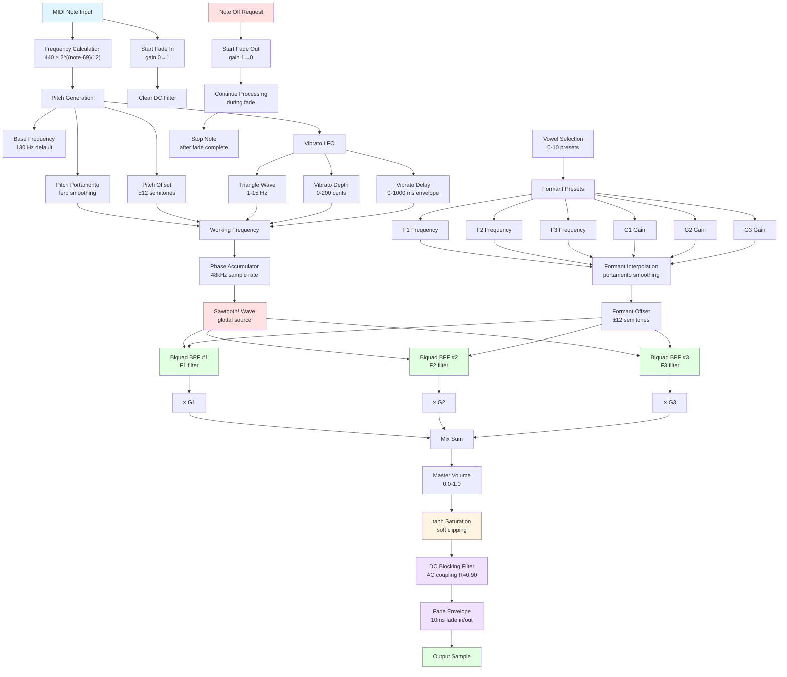

# Komyo

[光明] A platform-independent subtractive vocal synthesis engine for Japanese chant-style vocals.

# Demo
WASM Runtime on WebApp
[KoboTron](https://hugelton.com/apps/KoboTron/)

## Features

- **11 Formant Presets**: Japanese vowels (A, I, U, E, O) plus special phonemes (M, N, AE, Y, R, W)
- **Real-time Parameter Control**: Vibrato, portamento, pitch offset, formant offset
- **Note-based Interface**: MIDI-compatible `noteOn()`/`noteOff()` API
- **Header-only Library**: No compilation required, just include `komyo.h`
- **Cross-platform**: Works with any C++17 compiler (48kHz fixed sample rate)
- **Click-free Envelope**: 10ms fade in/out prevents clicks and pops at note on/off
- **DC Blocking**: AC coupling removes DC offset for clean output

## Quick Start

```cpp
#include "komyo.h"

using namespace Komyo;

// Create instance
Komyo chanter;

// Set parameters
chanter.setVowel(0);           // 0=A, 1=I, 2=U, 3=E, 4=O, 5=M, 6=N, 7=AE, 8=Y, 9=R, 10=W
chanter.setVibratoDepth(50.0f); // cents
chanter.setVibratoSpeed(5.5f);  // Hz
chanter.setMasterVolume(0.5f);

// In your audio callback (48kHz):
void audioCallback(float* output, int numSamples) {
    for (int i = 0; i < numSamples; i++) {
        output[i] = chanter.process();  // Generate one sample
    }
}

// Trigger notes:
chanter.noteOn(60.0f);  // MIDI note 60 (C4)
chanter.noteOff();
```

## Version History

### v1.1 (Current)
- **Added DC blocking filter** (AC coupling) to remove DC offset
- **Added fade envelope** (10ms fade in/out) for click-free note transitions
- Fade out continues audio processing until envelope completes
- Fixed pops and clicks at note on/off

### v1.0
- Initial release
- 11 formant presets for Japanese vowels
- Vibrato with delay envelope
- Portamento for smooth transitions
- Formant and pitch offset controls

## API Reference

### Initialization
```cpp
Komyo();  // Constructor, initializes to A vowel, 130Hz base frequency
```

### Vowel Selection
```cpp
void setVowel(int index);  // 0-10
```
- 0: A (Ah) - ア
- 1: I (Ee) - イ
- 2: U (Oo) - ウ
- 3: E (Eh) - エ
- 4: O (Oh) - オ
- 5: M (Mm) - 閉唇
- 6: N (Nn) - ン
- 7: AE (Ash) - æ
- 8: Y (Yue) - y
- 9: R (Ruh) - r
- 10: W (Wu) - w

### Formant Parameters
```cpp
void setPortamento(float speed);        // Formant transition speed (0-1)
void setFormantOffset(float st);        // Formant pitch shift in semitones (-12 to +12)
```

### Pitch Parameters
```cpp
void setPitchOffset(float st);          // Pitch offset in semitones (-12 to +12)
void setPitchPortamento(float speed);   // Pitch glide speed (0-1)
```

### Vibrato Parameters
```cpp
void setVibratoDepth(float cents);      // Vibrato depth in cents (0-200)
void setVibratoSpeed(float hz);         // Vibrato speed in Hz (1-15)
void setVibratoDelay(float ms);         // Vibrato onset delay in ms (0-1000)
```

### Master Parameters
```cpp
void setMasterVolume(float amp);        // Output level (0.0-1.0)
void setQ(float q);                     // Formant filter resonance (1-50)
void setBaseFreq(float freq);           // Base frequency in Hz
```

### Note Input
```cpp
void noteOn(float midiNote);            // Trigger note (MIDI note number)
void noteOff();                         // Stop note
```

### Audio Processing
```cpp
float process();                        // Generate one sample (call @ 48kHz)
void clear();                           // Reset internal state
```

## Technical Details

- **Sample Rate**: Fixed at 48kHz
- **Waveform**: Sawtooth^3 (glottal source approximation)
- **Filters**: 3× Biquad bandpass filters (formants F1, F2, F3)
- **LFO**: Triangle wave vibrato with delay envelope
- **Saturation**: tanh soft clipping
- **AC Coupling**: DC blocking filter to remove DC offset (R=0.90)
- **Fade Envelope**: 10ms fade in/out to prevent clicks and pops at note on/off

## DSP Signal Flow



## Formant Frequencies

| Vowel | F1 (Hz) | F2 (Hz) | F3 (Hz) | G1 | G2 | G3 |
|-------|---------|---------|---------|----|----|----|
| A     | 700     | 1200    | 2500    | 1.0| 0.6| 0.2|
| I     | 300     | 2300    | 3000    | 1.0| 0.3| 0.1|
| U     | 350     | 1200    | 2100    | 1.0| 0.4| 0.1|
| E     | 450     | 1800    | 2600    | 1.0| 0.5| 0.2|
| O     | 500     | 800     | 2300    | 1.0| 0.7| 0.1|
| M     | 250     | 1200    | 2200    | 1.0| 0.1| 0.05|
| N     | 200     | 800     | 1800    | 1.0| 0.15| 0.05|
| AE    | 550     | 1700    | 2400    | 1.0| 0.55| 0.15|
| Y     | 300     | 1700    | 2200    | 1.0| 0.45| 0.15|
| R     | 400     | 1100    | 1700    | 1.0| 0.5| 0.1|
| W     | 380     | 600     | 1900    | 1.0| 0.35| 0.1|

## Platform Integration

### VST/AU (iPlug2)
```cpp
#include "komyo.h"

class KomyoVST : public IPlugPlugin {
private:
    Komyo::Komyo chanter;

public:
    void ProcessBlock(float** inputs, float** outputs, int nFrames) {
        for (int i = 0; i < nFrames; i++) {
            outputs[0][i] = outputs[1][i] = chanter.process();
        }
    }
};
```

### Raspberry Pi Pico (Pico-SDK)
```cpp
#include "komyo.h"

Komyo::Komyo chanter;

void audio_callback() {
    int16_t sample = chanter.process() * 32767.0f;
    // Output to PWM/I2S
}
```

### Electrosmith Daisy
```cpp
#include "komyo.h"

Komyo::Komyo chanter;

void AudioCallback(AudioHandle::InputBuffer in,
                   AudioHandle::OutputBuffer out,
                   size_t size) {
    for (size_t i = 0; i < size; i++) {
        out[0][i] = out[1][i] = chanter.process();
    }
}
```

## License

MIT License - Copyright (c) 2025 Hügelton Instruments, Kōbe, Japan

Permission is hereby granted, free of charge, to any person obtaining a copy
of this software and associated documentation files (the "Software"), to deal
in the Software without restriction, including without limitation the rights
to use, copy, modify, merge, publish, distribute, sublicense, and/or sell
copies of the Software, and to permit persons to whom the Software is
furnished to do so, subject to the following conditions:

The above copyright notice and this permission notice shall be included in all
copies or substantial portions of the Software.

THE SOFTWARE IS PROVIDED "AS IS", WITHOUT WARRANTY OF ANY KIND, EXPRESS OR
IMPLIED, INCLUDING BUT NOT LIMITED TO THE WARRANTIES OF MERCHANTABILITY,
FITNESS FOR A PARTICULAR PURPOSE AND NONINFRINGEMENT. IN NO EVENT SHALL THE
AUTHORS OR COPYRIGHT HOLDERS BE LIABLE FOR ANY CLAIM, DAMAGES OR OTHER
LIABILITY, WHETHER IN AN ACTION OF CONTRACT, TORT OR OTHERWISE, ARISING FROM,
OUT OF OR IN CONNECTION WITH THE SOFTWARE OR THE USE OR OTHER DEALINGS IN THE
SOFTWARE.

## Author

**Leo Kuroshita** - Hügelton Instruments

- X: [@kurogedelic](https://x.com/kurogedelic)
